<p align="center">
  <a href="https://github.com/zakkycrypt01/p2p" rel="noopener">
    
  </a>
</p>

<h3 align="center">SuiXchange</h3>

<div align="center">

[](https://sui.io/overflow)
[]()
[](https://github.com/zakkycrypt01/p2p/issues)
[](https://github.com/zakkycrypt01/p2p/pulls)
[](LICENSE.md)

</div>

---

## 📝 Table of Contents

- [Problem Statement](#problem-statement)  
- [Idea / Solution](#idea--solution)  
- [Move Contract Workflow](#move-contract-workflow) 
- [Future Scope](#future-scope)  
- [Setting Up a Local Environment](#setting-up-a-local-environment)  
- [Usage](#usage)  
- [Technology Stack](#technology-stack)  
- [Contributing](#contributing)  
- [Authors](#authors)  
- [Acknowledgments](#acknowledgments)  

## 🧩 Problem Statement

The global rise of cryptocurrency adoption has highlighted the growing demand for decentralized trading solutions that are accessible, trustless, and user-centric. Despite this, existing P2P trading platforms face critical issues:

- **High Gas Fees**: Many blockchains impose significant transaction costs that hinder accessibility, especially in developing regions.  
- **Lack of Trustless Escrow**: Most platforms still rely on centralized systems for holding assets, introducing counterparty risk.  
- **Poor UX/UI**: Complex interfaces and non-intuitive flows reduce engagement, particularly for first-time users.  
- **Unstructured Dispute Handling**: Dispute resolution is often opaque or slow, which can erode user trust.  
- **Limited Fiat Coordination Tools**: Existing platforms don’t support smooth communication or verification between users making fiat transfers.

These problems create friction for users, reduce retention, and inhibit mass adoption.

---

## 💡 Idea / Solution

We introduce a **P2P Trading Platform** built on the **Sui blockchain**, offering a secure, gasless, and user-friendly way for individuals to exchange crypto assets.

### Key Features:
- **Auto Gas Fee Dripping**: Users with insufficient SUI to cover gas fees can leverage our automated gas fee dripping service, ensuring seamless transactions without interruptions.   
- **Smart Contract Escrow**: Trade security is guaranteed by Move-based escrow logic.  
- **Real-Time Trade Status & Chat**: Orders update in real-time with built-in encrypted messaging.  
- **Mobile-First Design**: Fully responsive with light/dark mode and smooth UX.  
- **Dispute Resolution**: Transparent on-chain flagging with admin review support.  
- **Off-Chain Indexing**: Fast search and filtering of listings via REST API and WebSockets.

This end-to-end solution supports secure, seamless fiat-crypto trading and lowers entry barriers through zero gas costs.

---

## ⚠️ Dependencies / Limitations

While powerful and feature-rich, the platform has some limitations:

- **Sui-Only**: Currently tied to the Sui blockchain; cross-chain support is planned.  
- **Off-chain Fiat Transfer**: Payments must still be coordinated off-chain by users.  
- **Manual Dispute Review**: While flagged on-chain, dispute resolution is still a semi-manual process until DAO governance is implemented.  
- **Web Wallets**: Limited to browser-based Sui Wallets; mobile wallet and Ledger support are on the roadmap.

---

## 🚀 Future Scope

The platform is fully operational but has a forward-looking roadmap to increase utility, decentralization, and adoption:

- **Mobile Applications**: Native Android and iOS apps to broaden reach.  
- **Automated Trading Bots**: For power users seeking algorithmic trade execution.  
- **DAO Governance**: Token-holders manage disputes and platform parameters.  
- **KYC & Compliance**: For legally regulated jurisdictions.  
- **Multi-chain Trading**: Support for additional Move-compatible blockchains.  
- **Incentive Systems**: Referral and loyalty programs for organic growth.

---

## 🛠️ Setting Up a Local Environment

Follow these steps to set up the project locally:

1. **Clone the repository**  
   ```bash
   git clone https://github.com/zakkycrypt01/p2p.git
   cd p2p
   ```

2. **Install dependencies**  
   ```bash
   npm install
   ```

3. **Set environment variables**  
   ```bash
   cp .env.example .env.local
   # Update keys as required
   ```

4. **Start development server**  
   ```bash
   npm run dev
   ```

5. **(Optional) Deploy smart contracts**  
   ```bash
   sui move build
   sui client publish
   ```

---

## ⚙️ Usage

1. **Connect Wallet**: Use Sui Wallet Adapter to connect your Sui-compatible browser wallet.  
2. **Create Listing**: Select token type, fiat equivalent, amount, expiration time, and payment method.  
3. **Order Book**: Browse listings, filter by token or price, and match with counterparty.  
4. **Escrow Trade**:  
   - Seller's tokens are locked on-chain.  
   - Buyer confirms payment.  
   - Seller verifies and releases.  
5. **Dispute**: Users can flag a trade and submit evidence; admins arbitrate.

---
## 🛠️ Move Contract Workflow

The following diagram illustrates the workflow of the Move smart contracts used in the platform:

```mermaid
%%{init: {'theme': 'base', 'themeVariables': { 'primaryColor': '#5D8AA8', 'primaryTextColor': '#fff', 'primaryBorderColor': '#5D8AA8', 'lineColor': '#6082B6', 'secondaryColor': '#62B1F6', 'tertiaryColor': '#D8BFD8' }}}%%
flowchart TD
  classDef mainNode fill:#5D8AA8,stroke:#333,stroke-width:2px,color:white,rounded
  classDef stateNode fill:#D8BFD8,stroke:#333,stroke-width:1px,color:black
  classDef functionNode fill:#62B1F6,stroke:#333,stroke-width:1px,color:white
  classDef objectNode fill:#A7C7E7,stroke:#333,stroke-width:2px,color:black,rounded

  linkStyle default stroke:#6082B6,stroke-width:2px,color:black

  %% Initialization section
  subgraph Initialization["Initialization"]
    init["init()"]:::functionNode --> config["Create EscrowConfig"]:::mainNode
    init --> token_reg["Create TokenRegistry"]:::mainNode
    init --> admin_cap["Create AdminCap"]:::mainNode
    token_reg --> add_sui["Add SUI Token"]:::functionNode
    token_reg --> add_usdc["Add USDC Token"]:::functionNode
  end

  %% Listing Management section
  subgraph Listing["Listing Management"]
    create_listing["create_listing()"]:::functionNode --> listing["Listing Object"]:::objectNode
    listing --> cancel_listing["cancel_listing()"]:::functionNode
    listing --> reclaim_expired["reclaim_expired_listing()"]:::functionNode
    listing --> create_order["create_order_from_listing()"]:::functionNode
    listing --- listing_states["ACTIVE, PARTIALLY_SOLD,<br> SOLD, CANCELED, EXPIRED"]:::stateNode
  end

  %% Order Flow section
  subgraph Order["Order Flow"]
    create_order --> order["Order Object"]:::objectNode
    order --> payment_made["mark_payment_made()"]:::functionNode
    payment_made --> payment_received["mark_payment_received()"]:::functionNode
    payment_received --> complete["Order Completed"]:::stateNode
    order --> cancel_order["cancel_order()"]:::functionNode
    order --> process_expired["process_expired_order()"]:::functionNode
    order --- order_states["ACTIVE, PAYMENT_MADE, COMPLETED,<br> CANCELED, DISPUTED, EXPIRED"]:::stateNode
  end

  %% Dispute Flow section
  subgraph Dispute["Dispute Flow"]
    payment_made --> create_dispute["create_dispute()"]:::functionNode
    create_dispute --> dispute["Dispute Object"]:::objectNode
    dispute --> respond["respond_to_dispute()"]:::functionNode
    dispute --> resolve_buyer["resolve_dispute_for_buyer()"]:::functionNode
    dispute --> resolve_seller["resolve_dispute_for_seller()"]:::functionNode
    dispute --- dispute_states["OPEN, RESOLVED_FOR_BUYER,<br> RESOLVED_FOR_SELLER"]:::stateNode
  end

  %% Admin Actions section
  subgraph Admin["Admin Actions"]
    admin_cap --> admin_cancel["admin_force_cancel_order()"]:::functionNode
    admin_cap --> update_fee["update_fee_collector()"]:::functionNode
    admin_cap --> update_expiry["update_expiry_params()"]:::functionNode
    admin_cap --> add_token["add_token_type()"]:::functionNode
    admin_cap --> set_token["set_token_status()"]:::functionNode
    admin_cap --> admin_dispute["Admin Dispute Resolution"]:::functionNode
  end

  %% Cross-linking with cleaner connections
  admin_dispute --> resolve_buyer
  admin_dispute --> resolve_seller
  payment_received --> config

  %% Styling for each subgraph
  style Initialization fill:#F0F8FF,stroke:#5D8AA8,stroke-width:2px
  style Listing fill:#E6E6FA,stroke:#5D8AA8,stroke-width:2px
  style Order fill:#F0FFF0,stroke:#5D8AA8,stroke-width:2px
  style Dispute fill:#FFF0F5,stroke:#5D8AA8,stroke-width:2px
  style Admin fill:#F5F5DC,stroke:#5D8AA8,stroke-width:2px
```


## 🧱 Technology Stack

| Layer                  | Stack                                |
|------------------------|--------------------------------------|
| **Frontend**           | React, Next.js, Tailwind CSS         |
| **Wallet Integration** | Sui Wallet Adapter                   |
| **Backend**            | Node.js, Express.js, TypeScript      |
| **Database**           | MongoDb                           |
| **Blockchain**         | Sui Network, Move Smart Contracts    |
| **Real-Time Updates**  | REST API, WebSockets                 |
| **Security**           | JWT, Encrypted Storage, Rate Limiting|

---

## 🤝 Contributing

We welcome community contributions but not yet open! To contribute:

- Fork the repository  
- Create a new feature branch  
- Make your changes  
- Submit a pull request

---

## 👥 Authors

- **ZakkyCrypt** – Smart-Contract Backend-Engineer Front-end developer [GitHub Profile](https://github.com/zakkycrypt01)  


---

## 🙏 Acknowledgments

Special thanks to:  
- **Mysten Labs** for the Sui blockchain and Move language.  
- **Open Source Tools** like TailwindCSS, WalletKit, Cetus.  
- **Hackathon Mentors** for guidance and validation.  
- **Sui Hackathon Community** for help and guidiance.

This platform is built by the community, for the community—pioneering a decentralized, secure, and gasless way to trade peer-to-peer.

